<div align="center">


# The Spectre

**Automate what can be. Focus on what can't.**

The public home of the studio: five AI operating systems that run a business's
repeatable work, with every outward action waiting for a human tap.

[](https://thespectre.one)
[](https://nextjs.org)
[](#deploy)

</div>

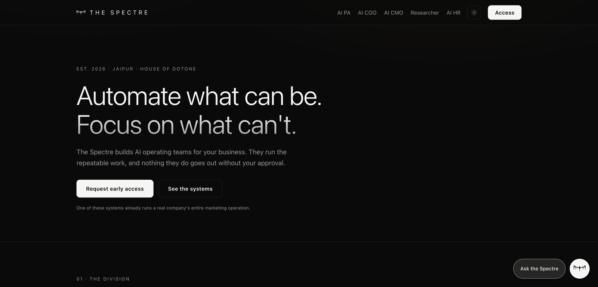

## What The Spectre is

The Spectre is a studio in Jaipur that builds AI operating teams for real
businesses. Each system takes over one seat's repeatable half: the status
reports, first drafts, monitoring, follow-ups, research legwork, scheduling,
data pulls, reconciliation. What stays with the owner is everything that
should: judgment, taste, relationships, the final call.

One rule binds every system: **the machine proposes, you decide.** Work is
staged as drafts, plans, orders and reports. Nothing is published, sent, or
spent until a human taps yes, and every action is logged. That is not a
setting someone turned on; it is how the architecture works.

This is not a promise of a future product. One of the five already runs a real
company's entire marketing operation (a luxury rug export house, live since
July 2026). The COO is in pilot at a manufacturing plant with about 400
machines. The researcher's method delivered a complete market-entry study,
every chapter re-verified, in July 2026.

The site's job is to make that case to people who distrust pitches: founders,
operators, investors. So it argues by comparison and demonstration, not
adjectives.

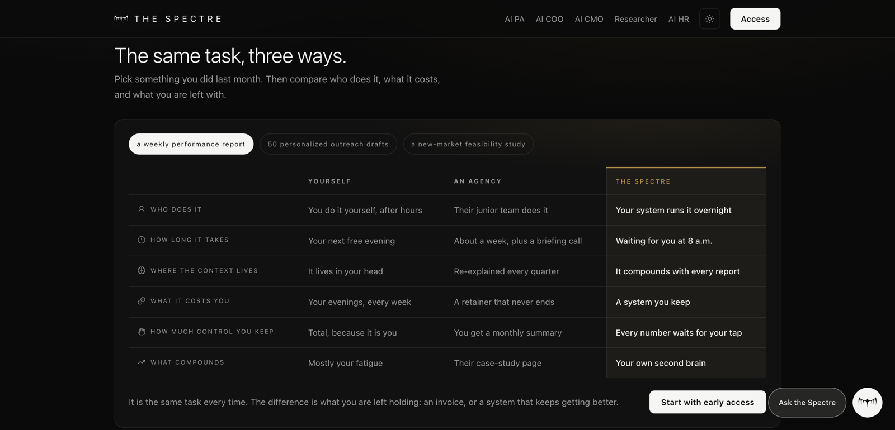

## The five systems

| System | In one line | Status |
|---|---|---|
| [AI PA · Second Brain](https://thespectre.one/pa/) | A second brain that remembers your world and quietly runs the other four. | Running in production |
| [AI COO](https://thespectre.one/coo/) | Watches your whole plant in real time and tests future orders before you commit. | In pilot build |
| [AI CMO](https://thespectre.one/cmo/) | A marketing department that never forgets your brand. | Running in production |
| [AI Researcher](https://thespectre.one/researcher/) | Research at the depth of a diligence committee, delivered in days and verified twice. | Method proven |
| [AI HR](https://thespectre.one/hr/) | Every people decision, from hiring to growth, made with full memory. | Taking design partners |

## Playgrounds, not videos

Every product page ends in a working playground. All of them are client-side,
deterministic and fictional, and each one says so on its face (every demo
carries a stamp like `SCRIPTED SHOWCASE · FICTIONAL DATA`). The point is to
let a visitor drive the product's logic before anyone gets on a call.

<table>
  <tr>
    <td width="50%">
      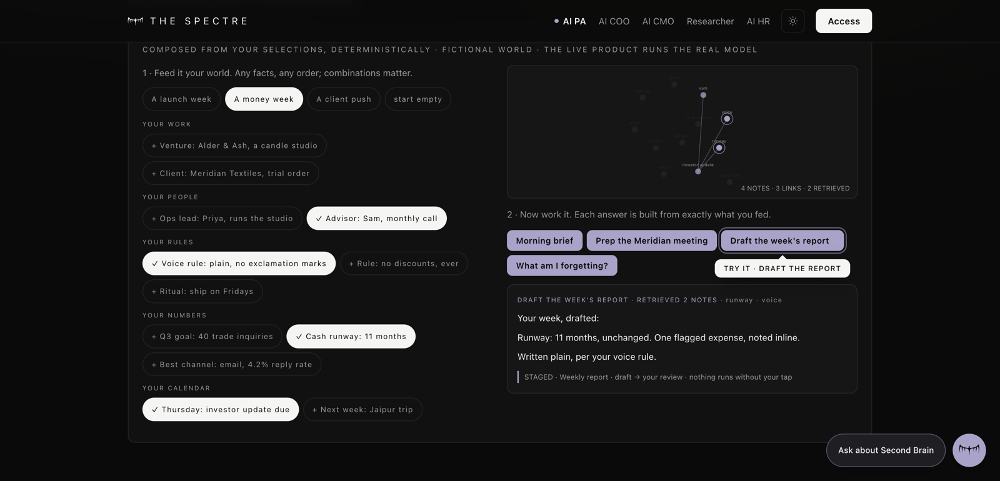<br>
      <sub><b>AI PA.</b> Feed it a fictional world (12 facts, 4 operations,
      ~4,000 possible states); every answer is composed from exactly what you
      selected, and the memory graph shows what was retrieved.</sub>
    </td>
    <td width="50%">
      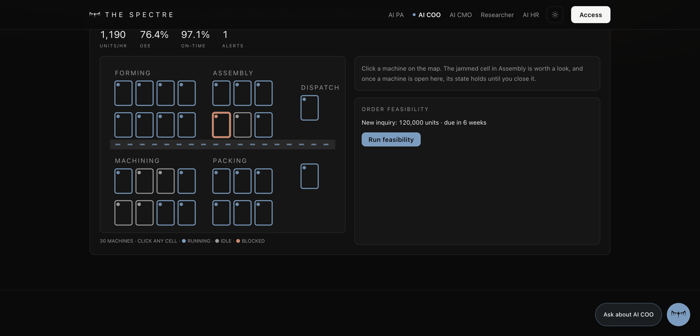<br>
      <sub><b>AI COO.</b> A live plant simulation: machines move through a
      realistic lifecycle state machine, KPIs derive from actual machine
      states, and a blocked line clears when you approve the fix.</sub>
    </td>
  </tr>
  <tr>
    <td width="50%">
      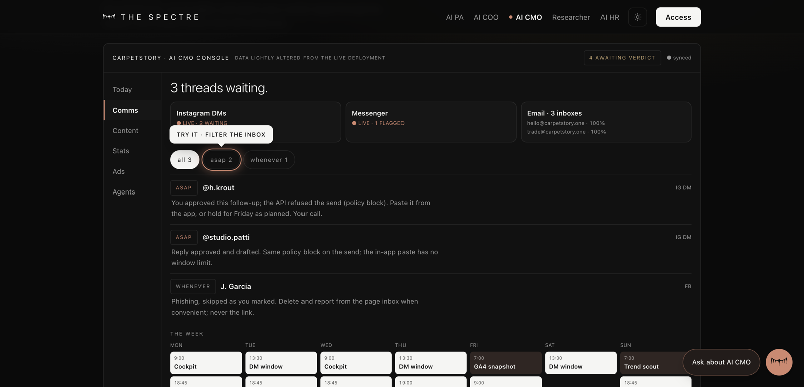<br>
      <sub><b>AI CMO.</b> A faithful miniature of the production console the
      real client uses, with lightly altered data: comms triage, content
      slate, stats, ads and the agent registry, sharing one live verdict
      counter.</sub>
    </td>
    <td width="50%">
      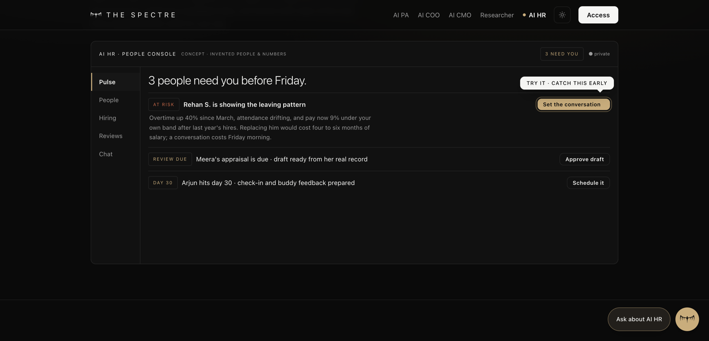<br>
      <sub><b>AI HR.</b> Five views on the people layer: attrition caught
      before the resignation, evidence-composed reviews, a hiring pipeline,
      and a chat that answers managers and employees differently.</sub>
    </td>
  </tr>
  <tr>
    <td width="50%">
      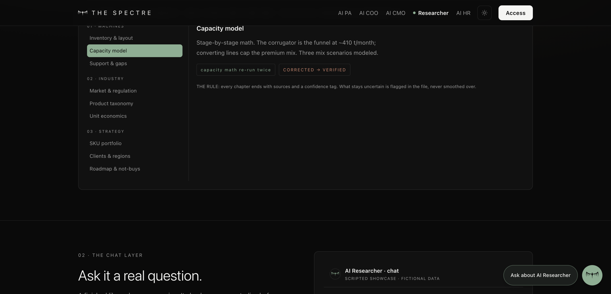<br>
      <sub><b>AI Researcher.</b> You receive a library, not a deck: an
      explorable evidence tree where every claim traces to its source.</sub>
    </td>
    <td width="50%">
      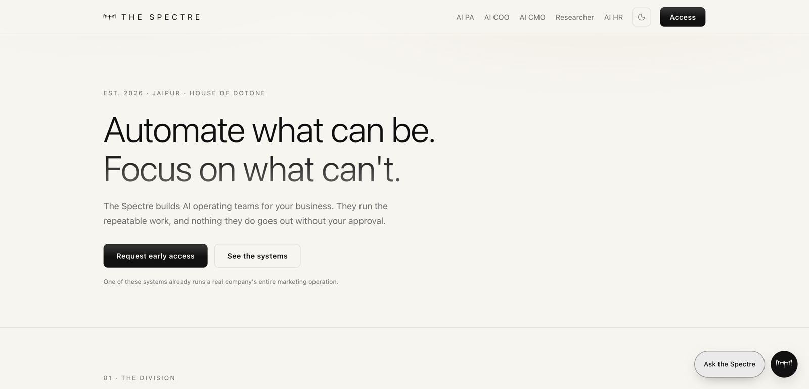<br>
      <sub><b>Both themes are first-class.</b> Dark is the default; the
      light theme is resolved before first paint, so there is no flash.</sub>
    </td>
  </tr>
</table>

## The chat layer

Every product carries a chatbot that knows its own domain. On this static
site it is a scripted preview with honest limits (it says so in the footer of
the panel); the live products run the real model against real data. Each page
also carries a cinematic showcase: a full worked conversation that only
starts once you can actually see it, checks the numbers step by step, and
ends with actions staged for approval.

<table>
  <tr>
    <td width="50%">
      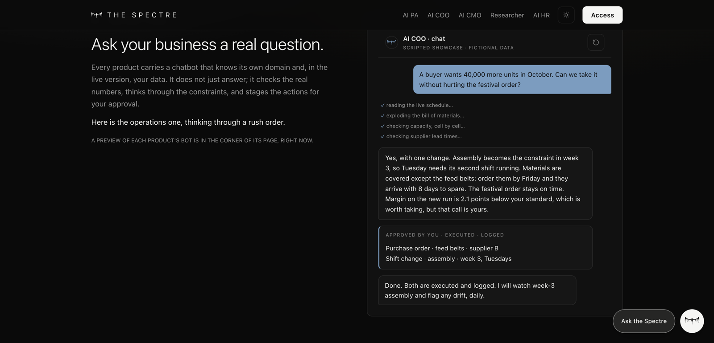<br>
      <sub>The COO bot thinking through a rush order: read the schedule,
      explode the bill of materials, check capacity and lead times, then
      stage the purchase order and the shift change for a tap.</sub>
    </td>
    <td width="50%">
      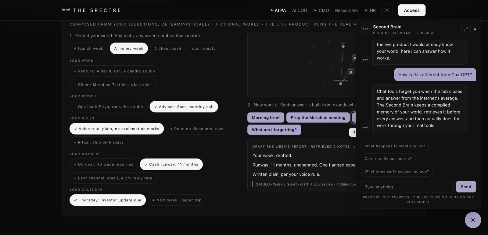<br>
      <sub>The corner widget, one persona per page (six in total), with
      streamed answers and set questions a first-time visitor actually
      asks.</sub>
    </td>
  </tr>
</table>

## Mobile

<table>
  <tr>
    <td>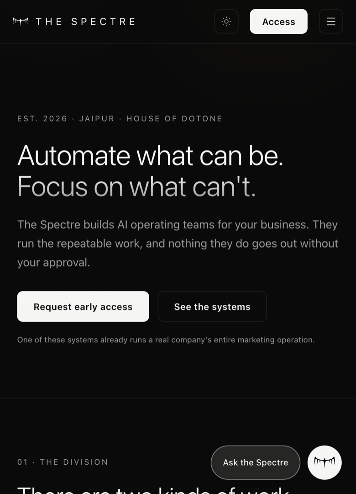</td>
    <td>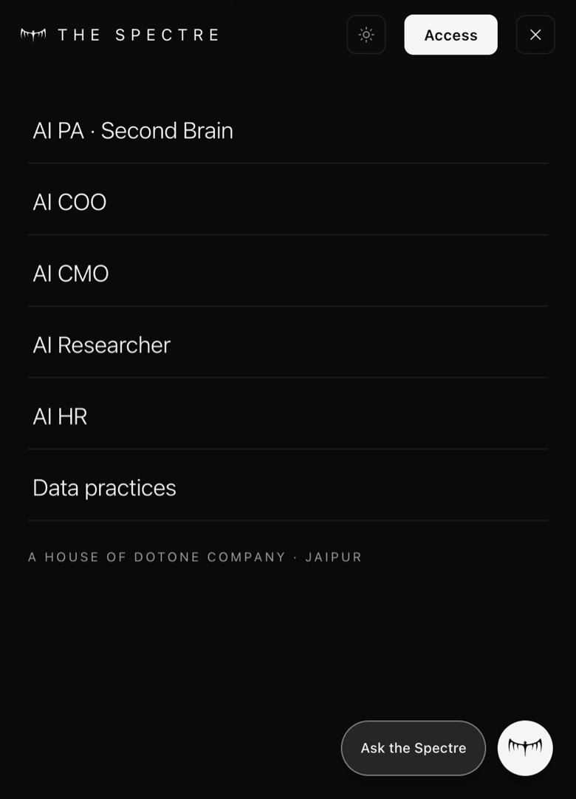</td>
    <td><sub>The whole site is built mobile-first: the nav collapses into a
    full-screen sheet, playgrounds reflow to single columns, and the chat
    panel goes fullscreen.</sub></td>
  </tr>
</table>

## How it is built

- **Next.js 16 static export** (`output: "export"`), React 19, Tailwind 4.
  The `next build --webpack` pin in `package.json` is load-bearing.
- **No backend, no keys, no third-party requests at runtime.** Fonts are
  self-hosted through `next/font`; there are no analytics scripts. The
  waitlist is a Netlify Form; replies are written personally within 48 hours.
- **Everything interactive is deterministic simulation.** State machines,
  seeded hashes and compositional logic, so demos are impressive without
  faking a model and without exposing anyone's data.
- **Motion is additive.** Content is visible by default; reveal animations
  attach only when JavaScript and motion preferences allow them. Showcases
  gate on real visibility (pixel math, not just intersection) so nobody
  misses the journey.
- **Design tokens** live in `src/app/globals.css` and nowhere else: near-black
  and warm-paper grounds, one hairline, brass reserved for the house, and one
  accent per product (Spectral, Steel, Clay, Archive, Ochre). Fraunces for
  display, Instrument Sans for text, Spline Sans Mono for data, Michroma for
  the wordmark.

## Repository map

```
src/app/          routes: / /pa /coo /cmo /researcher /hr /data, plus globals.css (all tokens)
src/components/   ui (nav, footer, reveal), mark, motifs, interactive (comparison, waitlist),
                  chat-widget, chat-showcase, and one playground per product
src/lib/          products.ts (roster), chat-content.ts (personas), chat-scenarios.ts (showcases)
netlify/          preview-gate/ (parked password gate; see Deploy)
.github/          workflows/deploy.yml (on-demand deploy)
docs/readme/      the screenshots in this file
```

## Develop

```bash
npm install
npm run dev        # local dev server
npm run build      # static export to out/
npm run lint
cd out && python3 -m http.server 4173   # serve the built site
```

## Deploy

Production is **[thespectre.one](https://thespectre.one)** on Netlify (apex
and www, HTTPS with an auto-renewing certificate, plain HTTP redirects).
The repo is deliberately **not** linked to Netlify; builds run locally or on
GitHub's runners, and Netlify only ever receives static files.

Deploys are **on-demand only**, by choice, to keep hosting credits flat.
Three equivalent triggers:

```bash
gh workflow run deploy.yml --repo the-spectre-one/website   # or the Run workflow button on GitHub
npx -y netlify-cli deploy --prod --build                    # straight from this directory
```

The Actions path needs one repo secret, `NETLIFY_AUTH_TOKEN` (a Netlify
personal access token). The site id in the workflow is not a secret.

To password-gate a preview again: move `netlify/preview-gate/gate.ts` back to
`netlify/edge-functions/`, restore the `[[edge_functions]]` block in
`netlify.toml`, and set `SITE_PASSWORD` in the Netlify environment. It is
parked outside the auto-bundled directory because an edge function on `/*`
bills one invocation per page view.

## House rules

1. **`raw/` never enters git or any deploy.** It holds proprietary client
   material and is gitignored. Keep it that way.
2. **Nothing on the site shows client data.** Demos run on generated,
   fictional datasets; the CMO console uses lightly altered numbers approved
   for public display. Every shipped number carries an as-of date.
3. **Copy is written for humans and must stay true.** Full sentences, no
   hype fragments, and claims that survive a fact-check.

---

<div align="center">
<sub>THE SPECTRE · A HOUSE OF DOTONE COMPANY · JAIPUR, INDIA</sub>
</div>
